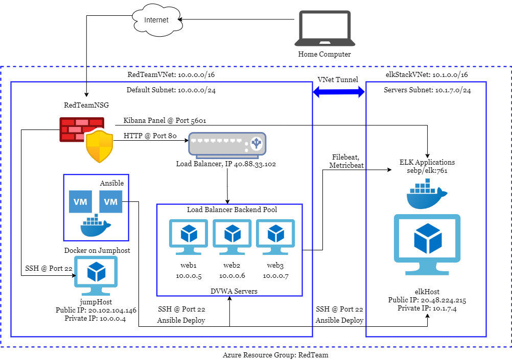
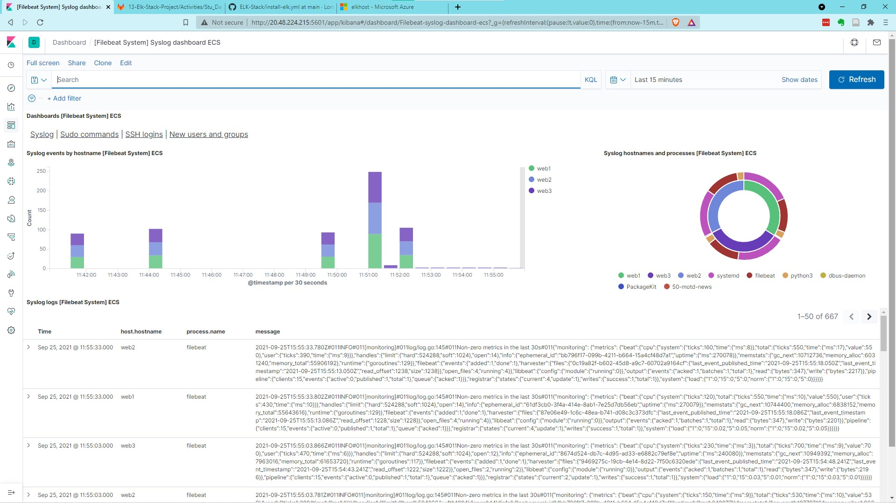
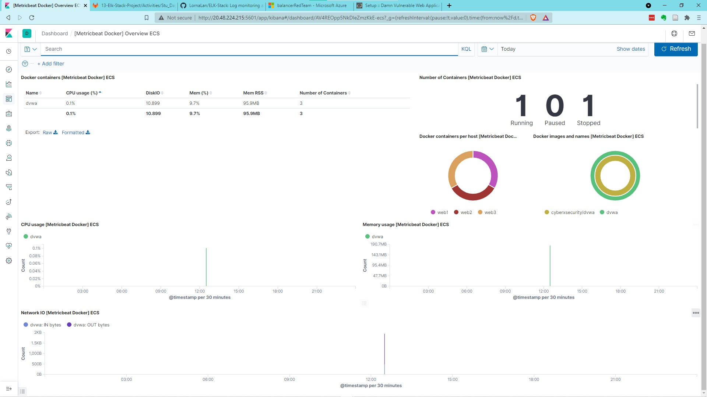
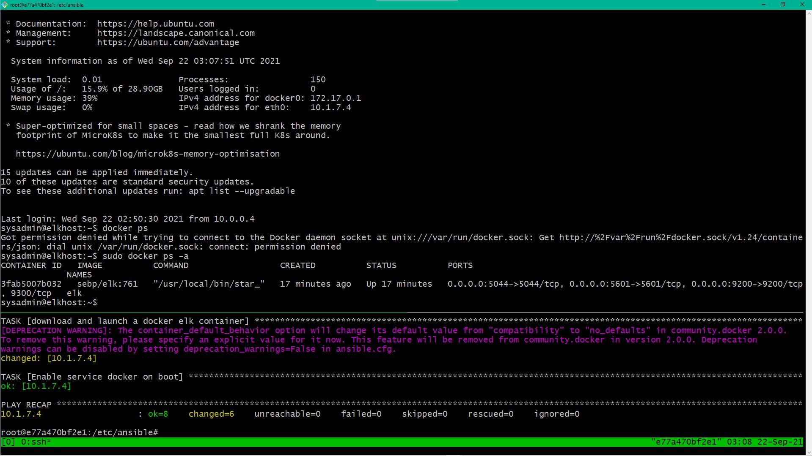

## Automated ELK Stack Deployment

The files in this repository were used to configure the network depicted below.

The files in this repository have been tested and used to generate a live ELK deployment on Microsoft Azure. The Ansible scripts to install all the required containers for ELK stack and DVWA webservers are under folder `yml-install`. Some other Ansible scripts for running tests and managing the deployed virtual machines (VMs) are under folder `yml-tests`. The Ansible configuration files are under `ansible-config` folder. There are also some shell scripts used for testing the VM setup, which are stored under `bash-scripts`. Images recording the test results are under the `image` folder. 

This document contains the following details:

1. Description of the Topology
2. Access Policies
3. ELK Setup and Configuration
4. Testing with ELK and DVWA servers
5. Acknowledgement

### Description of the Topology

The main purpose of this network is to expose a load-balanced and monitored instance of DVWA, the D*mn Vulnerable Web Application. This website is accessible by the public at http://40.88.33.102/setup.php when the containers are running.

The load balancer ensures that the application will be highly available, in addition to restricting unauthorized access to the network. It acts as a public facing interface between the private DVWA servers and the internet. 

Integrating an ELK server allows users to easily monitor the vulnerable VMs for changes to the docker metrics and system logs. More specifically, we used the Filebeat and Metricbeat applications from ELK.

- [Filebeat](https://www.elastic.co/beats/filebeat) is a lightweight system log monitoring system integrated with the Elastic Stack. It processes all the raw system log files in a queue, aggregates and parses them, and ships the result to Kibana for visualization. A typical Filebeat system dashboard is shown below, where it displays all the logs for system operations, sudo commands, ssh logins, and users and groups creation.

  

- [Metricbeat](https://www.elastic.co/beats/metricbeat) collects metrics about the deployed systems and sends them to Kibana for visualization. It displays many metrics of all your cloud VMs (in this case, the docker containers), such as CPU, memory and file system usage, disk and network IO statistics. A typical Metricbeat dashboard is shown below:

  

The configuration details of each machine may be found below.

| Name         | Function                                       | IP Address (Public)          | IP Address (Private) | Operating System          | Machine Hardware            |
| ------------ | ---------------------------------------------- | ---------------------------- | -------------------- | ------------------------- | --------------------------- |
| jumpHost     | Only Gateway to configure the internal network | 20.102.104.146               | 10.0.0.4             | Linux - Ubuntu 20.04 gen2 | 1 vCPUs, 1GB RAM, 30GB Disk |
| elkHost      | Base machine for running the ELK stack         | 20.48.224.215                | 10.1.7.4             | Linux - Ubuntu 20.04 gen1 | 2 vCPUs, 8GB RAM, 30GB Disk |
| Web{1, 2, 3} | Redundant servers for running DVWA             | 40.88.33.102 (Load Balancer) | 10.0.0.{5, 6, 7}     | Linux - Ubuntu 20.04 gen1 | 1 vCPUs, 2GB RAM, 30GB Disk |

### Access Policies

The machines on the internal network are not exposed to the public Internet. They are protected by a firewall, allowing access only through the expected service ports and protocols.

Access to the jumpHost machine is only allowed via SSH on port 22 from my home computer's IP address. The connection is also authenticated by RSA asymmetric key pairs, with the jumpHost holding the only public key generated from my home desktop via `ssh-gen`. 

Machines within the network can only be accessed by the Ansible Docker container running on the jumpHost. All the Ansible services and setups are run from that docker container, and the private DVWA webservers and ELK host machine hold the public key generated from that docker container only. The DVWA website can only be accessed via the load balancer's port 80 via HTTP protocol.

The Kibana visualization page is also restricted to be accessed from my home IP address only. To accomplish this, the firewall rule "allow TCP traffic to port 5601 of the ELK host machine from this IP" is added, while another lower-priority rule by default rejects all other traffics. The Kibana interface can be access via http://20.48.224.215:5601/app/kibana in a web browser.

A summary of the access policies in place can be found in the table below.

| Name          | Publicly Accessible | Allowed IP Addresses | Protocol @ Port |
| ------------- | ------------------- | -------------------- | --------------- |
| jumpHost      | Yes                 | my home IP           | SSH @ 22        |
| elkHost       | Yes                 | my home IP           | Kibana @ 5601   |
| web{1, 2, 3}  | No                  | N/A                  | N/A             |
| Load Balancer | Yes                 | any                  | HTTP @ 80       |

### ELK Setup and Configuration

Ansible was used to automate configuration of the ELK machine. No configuration was performed manually, which reduces human input error, and allows us to spin up similar machines with ease.

In order to use the playbook `yml` scripts, you will need to have an Ansible control node already configured. In this project, we used the Ansible container from `\cyberxsecurity\ansible` on [Docker Hub](https://hub.docker.com/r/cyberxsecurity/ansible). This node is set up and run on the Docker layer of the `jumpHost` machine. 

Assuming such a control node is configured and provisioned, do the following steps to set up Filebeat and Metricbeat on your DVWA web servers: 

1. SSH into the jump host machine, start the Ansible container, and attach to the container to run the following commands:

   - Go to `\etc\ansible` (or wherever the Ansible configuration files are) and modify your `hosts` file to setup the grouping and associated VM IP addresses (see the `ansible-config\hosts` file here as reference).  

   - In the same directory, modify line #107 in your `ansible.cfg` file, which should already be created by the installation, to include the remote machine's admin account user name. This account will be used by Ansible to perform all the set up tasks, so it should have `sudo` priviledges.

2. Run the `ansible-playbook install-elk.yml` command. The script installs Docker module and ELK container on `elkHost` machine. The allocated memory for the ELK application is increased to ensure the smooth running of the docker container, and the containers are set to restart after reboots.

   - The following screenshot displays the expected result of successfully configuring the ELK instance. After running the `docker ps -a` command on your ELK host, you should see the `sebp/elk:761` running, with the port mappings as configured.

     

   - Also verify that you can access the Kibana panel at the desired URL (`http://<server_public_ip>:5601/app/kibana`)

3. After confirming that Kibana runs correctly, run the `ansible-playbook filebeat/metricbeat-playbook.yml` command to install Filebeat and Metricbeat on your web servers. 

   - You can find the `filebeat-config.yml` file under the `yml-tests` folder, and modify line  #1805 and #1105 according to the ELK host server and web servers IPs
   - `metricbeat-config.yml` is also under the `yml-tests` folder. Modify line #62 and #92 according to your ELK host server and web servers IPs.
   - Update where you place these config files in your Ansible machine in line #15 in the `filebeat-playbook.yml` file and line #17 in the `metricbeat-playbook.yml` file.

4. Finally, navigate to your Kibana panel and check that you can see system log and metrics in the `logs` and `metric` panel.

   - There are additional guidelines on setting up Filebeat and Metricbeat within the Kibana panel.
   - Under Observability > Add log data > System logs, you can view the page for installing Filebeat and checking the data pipeline connection.
   - Under Observability > Add metric data > Docker metrics, you can view the page for installing Metricbeat for docker containers and checking the data pipeline connection.

### Testing with ELK and DVWA servers

There are a few other scripts worth mentioning in this repository:

- `yml-install/dockerweb.yml`: install Docker module and launch the DVWA web container on `web{1, 2, 3}` machines. Docker and DVWA web containers will always restart after each machine reboot.
- `yml-tests/cpu-test-via-ansible.yml`: stress the CPU cores on web servers to 100% and see if Kibana picks up the changes under the CPU statistics of Metricbeat. The Bash shell script required is under `bash-scripts/cpu-stress.sh`.
- `yml-tests/dos-test-via-ansible.yml`: use the `wget` command to download the index.html page of localhost and create large volume of network traffic. Monitor Kibana and see if Metricbeat picks up the change under the network traffic panel. The Bash shell script required is under `bash-scripts/wget-dos.sh`.
- `yml-tests/remote-transfer-files.yml`: an excessive but easy way to transfer files between the Ansible container and the rest of the web servers (or any remote servers Ansible controls).
- `bash-scripts/many-ssh-logins.sh`: create failed SSH login attempts to all three webservers and test if Filebeat will record these actions. This Bash shell can be run on any Linux server as the incorrect public key will deny all access anyway.

### Acknowledgement

I would like to thank the Teaching team from the Trilogy, 2U Inc. Cybersecurity Bootcamp from University of Toronto (2021-June cohort), for teaching us the basics of networking and web applications, providing us the starter scripts, and helping us troubleshoot along the way.
